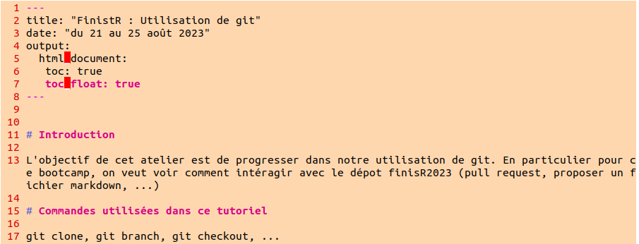

# Introduction

L'objectif de cet atelier est de progresser dans notre utilisation de git. En particulier pour ce bootcamp, on veut voir comment intéragir avec le dépot finisR2023 (pull request, proposer un fichier markdown, ...) 

# Historique

Dans la partie qui suit, on a travaillé avec deux ordinateurs et on a eu des conflits. On va voir comment on les a géré. On va donner les commandes que l'on a exécuté de façon chronologique, avec les deux ordinateurs.

**Ordinateur 1**

On commence par cloner le dépôt StateOfTheR/finistR2023 :
   
``git clone git@github.com:StateOfTheR/finistR2023.git``

On créer une nouvelle branche pour cet atelier git : 

``git branch Utilisation_de_git``

On se déplace sur cette branche : 

``git checkout Utilisation_de_git``

On crée un fichier Rmd dans un nouveau dossier dédié à cet atelier : 

    mkdir Utilisation_de_git
    cd Utilisation_de_git 
    nvim Utilisation_de_git.Rmd

On commit les modification et on les push dans le dépôt.

    git add .
    git commit -m "création d'une branche pour l'atelier sur git"
    git push --set-upstream origin Utilisation_de_git 

La partie `--set-upstream origin Utilisation_de_git` de la troisième commande n'est utile que parce que la branche n'existe pas encore dans le dépôt. 

A ce stade le fichier Utilisation_de_git.md est comme suit : 

**Ordinateur 2**

Avec le deuxième ordinateur, on a cloné le dépôt, on s'est placé sur la branche de l'atelier git, on a ajouté du texte au fichier Rmd sans modifier le texte déjà présent, puis on a pushé ces modifications sur le dépôt après avoir commité. Le fichier Utilisation_de_git.md est comme suit au moment du push :   

**Ordinateur 1**

En parallèle de cette opération sur le deuxième ordinateur, on a aussi fait un ajout sur le premier ordinateur : 

Après avoir fait ces changements, on a fait un git pull et on a eu un conflit auquel on ne s'attendait pas étant donnée que la nature des différences entre le fichier sur le dépôt et le fichier en local : 

On pensait pouvoir résoudre le conflit en fast forward, on a configuré le pull de cette façon :

`git config pull.ff only`

Puis on a fait un git pull. Ca n'a pas fonctionné.

[Manque le message d'erreur]

On a alors utilisé rebase : 

`git pull --rebase`

Puis on a **ouvert le fichier md pour gérer les conflits en supprimant les "=" et les ">"**, après quoi on a commit ces modifications. On a alors essayé de faire un push et on a eu le message d'erreur suivant : 

On a résolu le problème avec :

`git rebase --continue`

Le push a ensuite bien marché.

## Conclusion intermédiaire

On s'est dit que l'on avait pas bien géré le problème, qu'on aurait du configurer le pull de la façon suivante de façon à ce que git gère automatiquement le conflit.

`git config pull.rebase false`

On a fait ce test et voici les résultats.

## Arbre de la branche 

    1971  21/08/23 17:56:01 git pull --rebase
    1972  21/08/23 17:56:01 cd 
    1973  21/08/23 17:56:01 cd finistR2023/Utilisation_de_git/
    1974  21/08/23 17:56:01 nvim Utilisation_de_git.Rmd 
    1975  21/08/23 17:56:01 cd ..
    1976  21/08/23 17:56:01 git status
    1977  21/08/23 17:56:01 git add .
    1978  21/08/23 17:56:01 git commit -m "merge conflicts"
    1979  21/08/23 17:56:01 git push
    1980  21/08/23 17:56:01 git branch
    1981  21/08/23 17:56:01 git rebase --continue
    1982  21/08/23 17:56:01 git status
    1983  21/08/23 17:56:01 git push

# Commandes utilisées

# Brainstorming

- faire un repo propre, avec des logos, des sections, ...

# Commandes à suivre

- Créer une nouvelle branche : git branch nom_branche
- Se déplacer sur la nouvelle branche : git checkout nom_branche
- Ajouter le fichier RMD : git add
- Pusher la nouvelle branche : git push --set-upstream origin nom_branche

# Test conflit

test

# Test conflits encore et encore

Ce coup ci c'est la bonne

#Test conflit v2 
pull, push 

# Test Annaig conflit 
test 

# Annaig fait des conflits 

