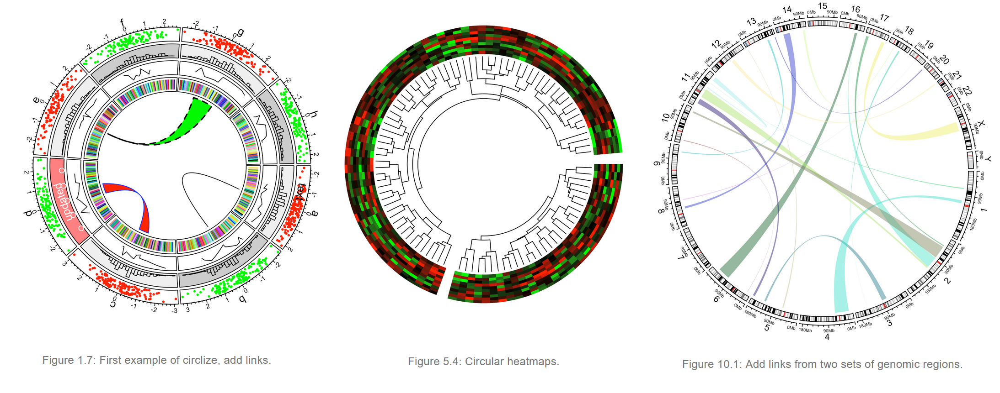
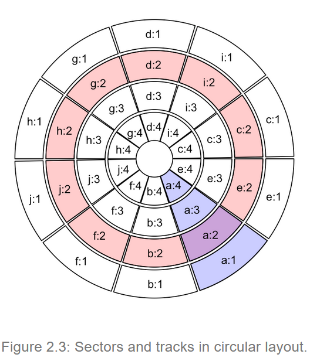

```{r setup, include=FALSE}
knitr::opts_chunk$set(echo = TRUE)
```


# Introduction 

Circlize est un package R qui permet de combiner des graphiques de manières circulaires. Toutes les possibilités du package circlize sont expliquées en détail sur ce site [https://jokergoo.github.io/circlize_book/book/introduction.html]. 

<center>

</center>

## Idées générales

Le cercle est divisé en **secteur (sector)**, qui est défini par une variable catégorielle. Chaque sector sera divisé en plusieurs **circuits (tracks)** concentriques, qui permettent de faire la construction du graphique depuis l'extérieur du cercle vers l'intérieur. Une intersection entre un secteur et un circuit s'appelle une  **cellule (cell)**.

<center>



</center>

Le package circlize contient différents types de fonction :

* Les fonctions globales, qui régissent la construction générale du cercle
  *  circos.initialize() 
  *  circos.track()
  *  circos.update()
  *  circos.par() 
  *  circos.info() 
  *  circos.clear()


* Les fonctions graphiques dites "bas niveau"
  * circos.points()
  * circos.lines()
  * circos.segments()
  * circos.rect()
  * circos.polygon()
  * circos.text()
  * circos.axis() ands circos.yaxis()

* Les fonctions graphiques dites "haut niveau"
  * circos.barplot()
  * circos.boxplot()
  * circos.violin()
  * circos.heatmap()
  * circos.raster()
  * circos.arrow()


* Les fonctions graphiques de liens entre cellule
  * circos.link()


   


```{r}
# Upload library
library(circlize)
 
# Create data
data = data.frame(
    factor = sample(letters[1:8], 1000, replace = TRUE),
    x = rnorm(1000), 
    y = runif(1000)
    )
```


```{r}
# Step1: Initialise the chart giving factor and x-axis.
circos.par(gap.degree=1)

circos.initialize( factors=data$factor,
                   x=data$x)

# Step 2: Build the regions. 
circos.track(factors = data$factor,
                       x= data$x,
                       y = data$y,
                       panel.fun = function(x,y){
                         circos.axis()
                         circos.points(x,y,col = "blue",pch= 16 , cex = 0.5)})
 
# Step 3: Add points
#circos.trackPoints(data$factor, data$x, data$y, col = "blue", pch = 16, cex = 0.5) 

# Step 3: Add points
circos.trackHist(data$factor, data$x, col = "red") 

circos.trackPlotRegion(factors = data$factor,y=data$y)
circos.trackLines(data$factor,data$x,data$y)
circos.clear()
```


```{r}
# Step1: Initialise the chart giving factor and x-axis.
circos.par(gap.degree=1,circle.margin=c(0.1,0.1,0.1,0.1),"points.overflow.warning" = FALSE)

circos.initialize( factors=data$factor,x = data$x)

# Step 2: Build the regions. 
circos.track(factors = data$factor,
                       x= data$x,
                       y = data$y,
                       panel.fun = function(x, y) {
                              #Print the sector names
                              circos.text(x = CELL_META$xcenter,
                                          y = CELL_META$cell.ylim[2] + mm_y(6),
                                          labels = CELL_META$sector.index,cex=0.6)  
                              circos.axis(labels.cex = 0.6)
})
 
# Step 3: Add points
col = rep(c("#FF0000", "#00FF00"), 4)
circos.trackPoints(data$factor, data$x, data$y, col = col, pch = 16, cex = 0.4)
# circos.trackHist(data$factor, data$x, col = "red") 
# circos.trackPlotRegion(factors = data$factor,y=data$y)
# circos.trackLines(data$factor,data$x,data$y)
circos.clear()
```

```{r}
par(mar = c(1, 1, 1, 1))
plot(c(-1, 1), c(-1, 1), type = "n", axes = FALSE, ann = FALSE, asp = 1)
draw.sector(20, 0)
draw.sector(30, 60, rou1 = 0.8, rou2 = 0.5, clock.wise = FALSE, col = "#FF000080")
draw.sector(350, 1000, col = "#00FF0080", border = NA)
draw.sector(0, 180, rou1 = 0.25, center = c(-0.5, 0.5), border = 2, lwd = 2, lty = 2)
draw.sector(0, 360, rou1 = 0.7, rou2 = 0.6, col = "#0000FF80")

```

# Application in Genomics

```{r}
library(tidyverse)
```


```{r}
df_arabidopsis <- readRDS(file = 'C:/Users/Annaig/Desktop/data/arabidopsis_processed/metaData_arabidopsisBT.rds')

df_arabidopsis_geno <- df_arabidopsis %>% mutate(POS2 = POS) %>% select(CHR, POS, POS2, contains("PVAL."))
df_arabidopsis_geno
```

# Creation du cytoband pour initialiser le circos: 

```{r}
cytoband_arabidopsis <- data.frame(chr=unique(df_arabidopsis$CHR),
                                   start = map_int(unique(df_arabidopsis$CHR),~df_arabidopsis%>% filter(CHR==.x) %>% pull(POS)  %>% min()),
                                   end=map_int(unique(df_arabidopsis$CHR),~df_arabidopsis%>% filter(CHR==.x) %>% pull(POS)  %>% max())) 
cytoband_arabidopsis
```

# Initialisation circos

```{r}
circos.initializeWithIdeogram(cytoband_arabidopsis,plotType = c("axis", "labels"))
circos.clear()
```

```{r}
circos.genomicInitialize(cytoband_arabidopsis)
circos.clear()
```


# Subset of chromosomes

```{r}
circos.initializeWithIdeogram(cytoband_arabidopsis,chromosome.index = c(3,5,2),plotType = c("axis", "labels"))
circos.clear()
```

# Some general settings 

```{r}
circos.par("start.degree" = 90,"gap.degree" = rep(3, nrow(cytoband_arabidopsis)))
circos.initializeWithIdeogram(cytoband_arabidopsis,plotType = c("axis", "labels"))
circos.clear()
```
# Add Points

```{r}
df_arabidopsis_genoA <- df_arabidopsis_geno %>% mutate(log10PVAL.A = -log10(PVAL.A)) %>%  select(CHR, POS, POS2, log10PVAL.A)

circos.par("start.degree" = 90,"gap.degree" = rep(3, nrow(cytoband_arabidopsis)))
circos.initializeWithIdeogram(cytoband_arabidopsis,plotType = c("axis", "labels"))
circos.genomicTrack(df_arabidopsis_genoA,ylim=c(8,0),
    panel.fun = function(region, value, ...) {
        circos.genomicPoints(region, value, pch = 16, cex = 0.2,col=get.current.chromosome(),baseline="top")
      ## 1e-5 pval threshold 
      circos.segments(CELL_META$cell.xlim[1], 5, CELL_META$cell.xlim[2], 5,lty = 2)
      
})
circos.clear()
```


```{r}
df_arabidopsis_genoA <- df_arabidopsis_geno %>% mutate(log10PVAL.A = -log10(PVAL.A)) %>%  select(CHR, POS, POS2, log10PVAL.A)

pvalth <- 5
pvalth2 <- 8
col_palette <-  RColorBrewer::brewer.pal(5, "Set2")


circos.par("start.degree" = 90,"gap.degree" = rep(3, nrow(cytoband_arabidopsis)))
circos.initializeWithIdeogram(cytoband_arabidopsis,plotType = c("axis", "labels"))
circos.genomicTrack(df_arabidopsis_genoA,ylim=c(8,0),
    panel.fun = function(region, value, ...) {
      col_value <- rep(col_palette[get.current.chromosome() %>% as.numeric()],nrow(value))
      col_value[value>pvalth] <- "red"
      # print(value)
      circos.genomicPoints(region, value, pch = 16, cex = 0.2,col=col_value,baseline="top")
      ##  pval threshold 
      circos.segments(CELL_META$cell.xlim[1], pvalth, CELL_META$cell.xlim[2], pvalth,lty = 2)
      circos.segments(CELL_META$cell.xlim[1], pvalth2, CELL_META$cell.xlim[2])
      
})
circos.clear()

```


```{r}
df_arabidopsis_genoA %>% filter(CHR==1) %>% nrow()
```


circos.yaxis()


```{r}
df_arabidopsis_genoA <- df_arabidopsis_geno %>% select(CHR, POS, POS2, PVAL.A)

# circos.par("start.degree" = 90,"gap.degree" = rep(3, nrow(cytoband_arabidopsis)))

circos.initialize(sectors = df_arabidopsis_genoA$CHR,x =df_arabidopsis_genoA$POS)

col = rep(c("#FF0000", "#00FF00"), 3)[1:5]
circos.trackPoints(sectors = df_arabidopsis_genoA$CHR,y = -log10(df_arabidopsis_genoA$PVAL.A),x =df_arabidopsis_genoA$POS, pch = 16, cex = 0.4)
circos.clear()
```
